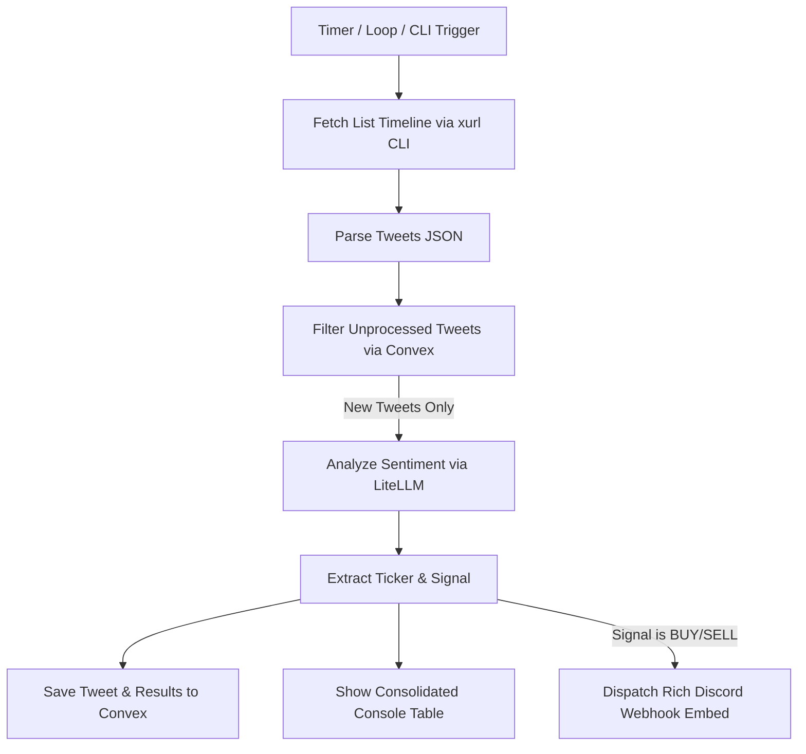

# Architecture - Tweet Alpha Tracker

This document details the system design, execution flow, data storage, and external integrations for the **Tweet Alpha Tracker** application.

---

## 1. System Overview

The Tweet Alpha Tracker is a lightweight automated tool that reads tweets from a designated Twitter list, filters for new tweets, extracts stock/crypto tickers, and classifies investment sentiment (signals) using the xAI Grok API. For high-priority signals (`buy` and `sell`), rich embed alerts are dispatched to a Discord webhook.



---

## 2. Component Breakdown

### A. Scraper / Fetcher (`xurl` CLI Wrapper)
- **Tool**: The application invokes the official `xurl` CLI tool using Python's `subprocess` module.
- **Arguments**: Runs `xurl --app <XURL_APP_NAME> "/2/lists/<LIST_ID>/tweets?expansions=author_id&user.fields=username"`, where `<XURL_APP_NAME>` is loaded dynamically from the `backend/.env` configuration.
- **Session Auth**: For local development, authentication is managed via local X/Twitter authorization (PKCE/OAuth) securely stored in the system configuration. For containerized production deployments (e.g., Coolify), the application automatically initializes `xurl` credentials on script boot via the `init_xurl()` function. This function reads credentials from the `XURL_CONFIG_DATA` environment variable, writes them to a writable persistent volume at `/home/nixpacks/.config/xurl_data/config`, and symlinks it to the expected location (`/home/nixpacks/.xurl`) to support dynamic session read/write events.
- **Robust JSON Parsing**: Decodes the standard X API v2 payload. Maps each tweet's `author_id` to its corresponding `username` handle within the `includes.users` metadata block, rendering a unified array of normalized tweet structures.
- **Credential Failure Detection**: Scans subprocess exit codes and searches stderr for credential-related signatures (e.g. `401`, `unauthorized`, `expired`). If detected, raises `BirdCredentialError` (retained for backward compatibility) to dispatch an alert embed to the Discord webhook.

### B. Database Layer (Convex)
- **Service**: Hosted Convex Backend (real-time BaaS platform)
- **Folder**: `frontend/convex/`
- **Tables**:
  - `processed_tweets`: Caches tweets and extraction results.
    - **Schema**:
      - `tweetId` (string): Used to uniquely identify the tweet and prevent duplicate processing.
      - `username` (string): The Twitter handle of the poster.
      - `text` (string): The body of the tweet.
      - `tickers` (string): Comma-separated list of identified tickers.
      - `signal` (string): Classification of the tweet (one of `buy`, `sell`, `bullish`, `bearish`, `neutral`).
      - `processedAt` (string, optional): ISO timestamp of when the tweet was processed.
    - **Index**: `by_tweetId` on `tweetId` (provides O(1) duplicate checks).
    - **Batch Query**: `tweets:checkProcessedTweets` is used to batch-query multiple tweet IDs concurrently on the backend, minimizing network round-trip overhead.
  - `tracker_runs`: Records execution metrics for each tracker run.
    - **Schema**:
      - `tweetsProcessed` (number): Number of new tweets successfully processed during the run.
      - `modelUsed` (string): The model name used for sentiment classification (e.g. `xai/grok-4-1-fast-non-reasoning`).
      - `totalInputTokens` (number): Total prompt tokens consumed during the run.
      - `totalOutputTokens` (number): Total completion tokens consumed during the run.
      - `totalCost` (number): Total execution cost in USD.
      - `timestamp` (string, optional): ISO timestamp of the run.

### C. Sentiment Analysis & Extraction (LiteLLM Wrapper)
- **Multi-Model Integration**: Invokes a dynamic model via LiteLLM specified by `ACTIVE_MODEL` in the environment configuration (e.g., `xai/grok-4-1-fast-non-reasoning`, `gemini/gemini-2.5-flash`).
- **Dynamic Cost Tracking**: Uses `genai-prices` first to calculate precise USD execution costs dynamically per run using exact, updated market pricing databases. Falls back to LiteLLM's internal `completion_cost()` and finally `0.0` if the target model is unmapped in the `genai-prices` database.
- **Prompt Specification**: Commands the selected model to perform financial analysis, extract any stock/crypto symbols, and return a clean, unadorned JSON object containing keys:
  - `"tickers"`: List of upper-case strings (e.g. `["BTC", "SOL"]`)
  - `"signal"`: Sentiment classification string (`"buy"`, `"sell"`, `"bullish"`, `"bearish"`, or `"neutral"`)
- **Error Retries & Resilience**: The completion call wraps LiteLLM requests in a robust retry handler with exponential backoff (up to 5 attempts, starting at 2 seconds). Known permanent exceptions (e.g. invalid API key or bad request) bypass retries, while transient network issues, 503 Service Unavailable, and 429 Rate Limit conditions are automatically retried to ensure reliability.
- **JSON Sanitization**: Robustly strips markdown wrappers (such as ```json) before passing results to the JSON parser.
- **Guaranteed Ticker Deduplication & Normalization**: Filters out redundant stock or crypto tickers returned by the model while preserving their original order, stripping whitespace, and normalizing them to uppercase. Additionally, strips any leading `$` characters (e.g., converting `"$IOVA"` to `"IOVA"`) to prevent Convex JSON serialization errors, which strictly forbid object keys from starting with `$`. This guarantees a clean, unique, and safe ticker key representation across downstream CLI logs, Convex database storage, real-time stats aggregation, and Discord alerts.

### D. Console Output
- Renders a clean, tabular layout using Python's native f-strings to display:
  - Twitter handle (prefixed with `@`)
  - Identified tickers
  - Signal (sentiment classification)
  - Text preview (first 40 characters)

### E. Alert Dispatcher (Discord Webhooks)
- When a `buy` or `sell` signal is extracted, an alert is transmitted to the configured Discord Webhook.
- Uses color-coded embeds:
  - **Green (`0x00FF00`)**: For `buy` signals.
  - **Red (`0xFF0000`)**: For `sell` signals.
- Includes fields detailing the poster, tickers, tweet content, and a direct clickable URL back to the tweet on X.
- **Credential Failure Alerts**: If the wrapper detects a credentials error, it dispatches an orange embed alert (`0xFF9900`) detailing the specific failure logs to the configured Discord Webhook to prompt credential renewal.

### F. Model Cost Viewer Utility (`backend/model_costs.py`)
- **Purpose**: A standalone command-line tool to inspect and compare token pricing (input and output costs) across diverse LLMs supported by LiteLLM.
- **Features**:
  - Dynamically extracts pricing metadata from `genai-prices` snapshot database first for absolute accuracy.
  - Falls back to `litellm.model_cost` internal pricing if `genai-prices` lookup fails.
  - Formats costs per **1 million tokens** for easy visualization.
  - Displays context window sizes (Max Tokens).
  - Groups/filters by provider, searches by model substring, and sorts dynamically.
  - Includes a curated list of top models for primary providers by default.

---

## 3. Data Flow Execution Sequence

1. **Initialization**:
   - Loads `backend/.env` and `.env.local` configurations to retrieve `CONVEX_URL`.
   - Establishes a lightweight connection to the Convex backend using `ConvexClient`.
2. **Fetch Phase**:
   - Executes the `xurl` v2 list tweets API endpoint.
   - Decodes stdout from JSON and constructs a normalized list of tweet objects with usernames mapped from expansions.
   - Scans output for credentials issues; if a credentials error is found, raises `BirdCredentialError`, sends a system alert embed to the Discord webhook, and gracefully aborts the current run.
3. **Filter Phase**:
   - Queries the Convex backend database in a single batch operation for all tweet IDs using the `tweets:checkProcessedTweets` query.
   - Falls back to querying individual tweet IDs via `tweets:isTweetProcessed` in case of unexpected remote schema discrepancies or query errors.
   - Keeps only tweets not already recorded in the `processed_tweets` table.
4. **Analysis & Storage Phase**:
   - For each unprocessed tweet, invokes the configured LLM through LiteLLM (with automatic retries for transient errors).
   - Parses the JSON response.
   - Mutates Convex using the `tweets:saveProcessedTweet` mutation to insert the record, ensuring it is never processed again.
   - Prints a row in the console terminal table.
   - If the signal is `buy` or `sell`, dispatches the Discord embed immediately.
5. **Post-Run Log**:
   - Calls the `runs:saveRunRecord` mutation to store the overall tracker metrics and execution costs in the Convex backend database.
6. **Scheduler**:
   - If executed in daemon mode (default), sleeps for 900 seconds (15 minutes) before restarting the flow.
   - If executed with `--once`, shuts down cleanly.

---

## 4. Frontend Live Dashboard

The dashboard provides a real-time command terminal to monitor, search, and analyze processed tweets, runner logs, and LLM expenses.

### A. Tech Stack
- **Framework**: React 19 + TypeScript + Vite.
- **Real-Time Data Layer**: Convex React Client using high-performance WebSocket subscriptions (`useQuery`).
- **Styling**: Modern custom Vanilla CSS with custom HSL design tokens, glassmorphism, responsive grid boundaries, and micro-animations.
- **Charts**: Recharts library configured with a bespoke theme matching the dark indigo terminal colors.

### B. Core UI Components (`frontend/src/App.tsx`)
1. **Live status navigation bar**: Features a green pulsing dot connected to active server synchronization events.
2. **KPI Metrics Cards**: Real-time counter metrics measuring total tweets screened, alpha signals extracted (bullish or buy), accumulated token execution cost (fixed at 6 decimal places), and scheduler run frequency.
3. **Interactive Alpha Stream Feed**:
   - Scrolling list of processed tweets styled with responsive layouts.
   - Colored visual badges marking sentiment classification (`BUY`, `SELL`, `BULLISH`, `BEARISH`, `NEUTRAL`). High-severity badges like `BUY` / `SELL` pulse continuously.
   - Fully searchable by text, ticker, or user handle, and filterable by signal severity level.
   - Clickable direct anchors to view the tweet natively on X.
4. **Trending Tickers Watchboard**: A dynamically computed tag-cloud representing most mentioned stock or crypto tickers sorted by frequency. Clicking on any ticker instantly filters the live Alpha Feed to show only tweets containing that ticker.
5. **Interactive Analytics Panel**:
   - **Sentiment Mix**: A custom Recharts inner-donut PieChart rendering the exact proportion of each sentiment signal.
   - **Execution Costs Trend**: A Recharts LineChart mapping the execution expenses and efficiency across recent scraping runs in chronological sequence.
6. **Background Runs Log**: Real-time monitor of scraper cron jobs tracking execution timestamps, new tweets processed, exact model used, and run costs.
7. **Real-time Sound Notification Alerts**: Emits a pleasant retro-futuristic double chime sound when a new high-severity signal (`buy` or `sell`) is processed and appended to the data stream. Built using the browser's native Web Audio API (completely self-contained, zero asset load delay). Includes a persistent audio setting toggle (`SOUNDS ON` / `MUTED`) and a manual `TEST` trigger in the navigation header, fully responsive on all screen sizes.

---

## 5. Deployment & Hosting (Coolify)

The tracker daemon is designed for persistent background deployment on a **Coolify** server.

- **Process Manager Integration**: A standard, extensionless `Procfile` is placed in the `backend/` directory of the project.
- **Build Environment Configuration (`nixpacks.toml`)**: Instructs Nixpacks during the setup phase to install `curl` and `ca-certificates`, download and install the `xurl` binary from its installer script, and permanently append the `xurl` binary directory to the system `PATH` env var (`/home/nixpacks/.local/bin:$PATH`).
- **Process Target**: Declares `worker: python main.py` to instruct Coolify to spawn and maintain the Python daemon as a persistent worker process from the `backend/` directory.
- **Automatic Daemon Loops**: Runs infinitely in the background, querying the targeted Twitter list and updating Convex every 15 minutes, with built-in credentials failure reporting.
